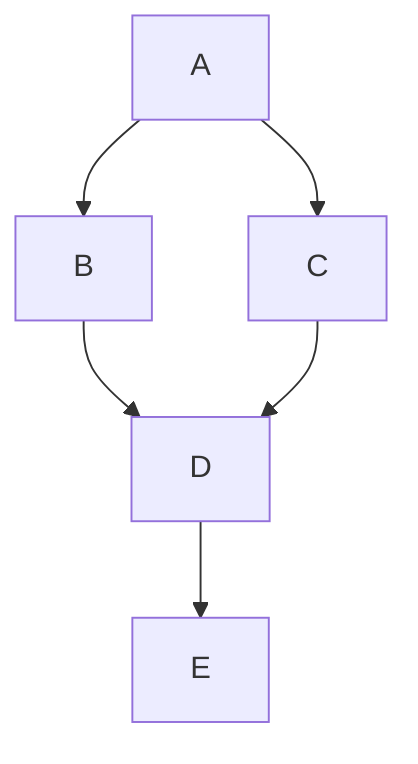
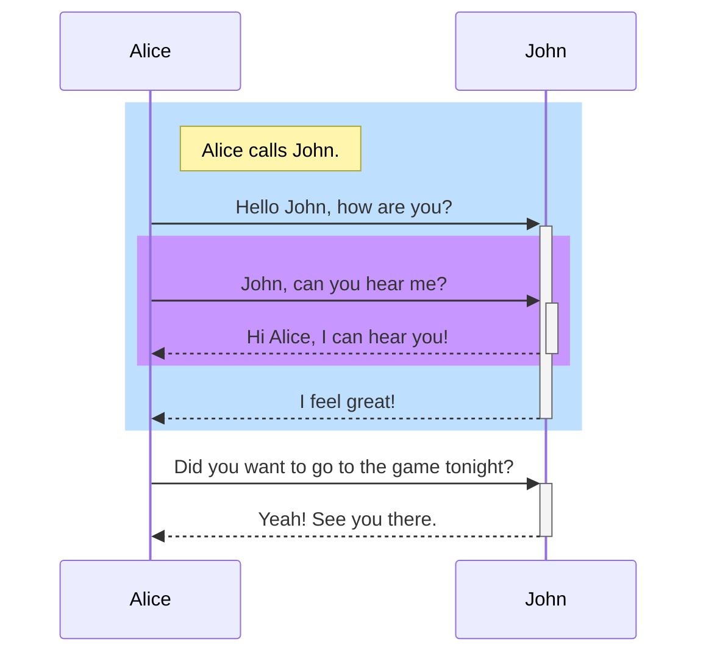

# Markdown Sample

## Inlines
### Text attributes

*Italic*

**Bold**

***Bold and italic***

~~Strikethrough~~

### Code

`printf("hello, world\n");`

### Emoji

:smile: :+1:

### Bullet list items

- Bullet list item 1
- Bullet list item 2
  - Bullet list item 2-1

### Ordered list items

1. Ordered list item 1
1. Ordered list item 2
   1. Ordered list item 2-1
   1. Ordered list item 2-2

### Task list items

- [ ] Task list item 1
  - [ ] Task list item 1-2
- [x] Task list item 2
  - [x] Task list item 2-2

### Headings
# Heading 1
## Heading 2
### Heading 3
#### Heading 4
##### Heading 5
###### Heading 6

## Blocks
### Quotes

> Block quotes text 1
>> Block quotes text 2

### Tables

| Default   | Center-aligne | Left-aligned | Right-aligned |
| --------- |:-------------:| :----------- | -------------:|
| Default   | Center        | Left         | Right         |
| Default   | Center        | Left         | Right         |

### Code

```c
/* Hello world in C */
#include <stdio.h>

main(void) {
    printf("hello, world\n");
}
```

### Diagrams

#### Flowcharts

See [Flowcharts](https://mermaid-js.github.io/mermaid/#/flowchart)



#### Sequence diagrams

See [Sequence diagrams](https://mermaid-js.github.io/mermaid/#/sequenceDiagram)


